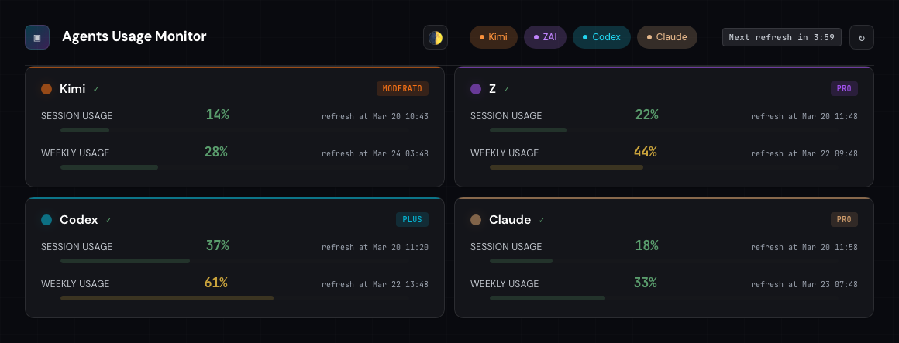

# Agents Usage Monitor

Self-contained Go binary for monitoring AI assistant usage across **Kimi Code**, **Z-AI**, **OpenAI Codex**, and **Claude**.

> **Based on:** [konradozog-debug/AgentsUsageDashboard](https://github.com/konradozog-debug/AgentsUsageDashboard) - A complete Go rewrite of the original Python/Docker implementation with Firefox/VNC automation. This version uses manual credential configuration and requires no Docker or browser containers.



Dashboard showing all 4 AI assistants connected with real-time usage monitoring and live countdown timer.

## Provider Status

| Provider | Status | Auth Method | Notes |
|----------|--------|-------------|-------|
| **Kimi** | ✅ Working | Cookie (JWT) | Session + weekly usage |
| **Z-AI** | ✅ Working | API Key | Session + weekly usage |
| **Codex** | ✅ Working | OAuth | Requires Codex CLI setup (see [docs/codex-oauth.md](docs/codex-oauth.md)) |
| **Claude** | ⚠️ Blocked | Cookie | Cloudflare blocking (may not work) |

**Note:** Cookie-based Codex auth is deprecated. Use OAuth instead.

## Features

- **Unified usage view** - Session and weekly usage for 4 AI assistants in one place
- **Provider toggles** - Enable/disable providers instantly from the header bar
- **Real-time monitoring** - Robust auto-refresh with background tab support
- **Live countdown** - Shows exactly when data will refresh next
- **Smart refresh** - Visibility API ensures fresh data when switching tabs
- **Single binary** - No Docker required (~15MB)
- **Dark theme** - Clean, modern UI with color-coded usage bars
- **Zero dependencies** - Embedded frontend, no external services

## Quick Start

### Prerequisites

- Go 1.24+ (for building) or download pre-built binary

### Installation

```bash
# Clone and build (creates self-contained ~15MB binary)
git clone https://github.com/bartech-lab/agents-usage-dashboard.git
cd AgentsUsageDashboard
go build -o agents-dashboard

# Create config
cp config.yaml.example config.yaml
cp .env.example .env
```

### Configure

Edit `.env` with your credentials (at minimum, add Z-AI or Kimi):

```bash
# Required - choose at least one
ZAI_API_KEY=your-id.your-secret
KIMI_AUTH_TOKEN=your-kimi-token

# Optional - Claude (blocked by Cloudflare)
CLAUDE_SESSION_KEY=

# Codex - no env vars needed, uses OAuth tokens
# See docs/codex-oauth.md for setup
```

### Run

```bash
./agents-dashboard
```

Open http://localhost:8777

## Provider Configuration

### Kimi (Working ✅)

**Method:** Cookie-based authentication

1. Log in to kimi.com in your browser
2. Open DevTools → Application → Cookies → kimi.com
3. Copy the `kimi-auth` cookie value
4. Add to `.env`:
   ```bash
   KIMI_AUTH_TOKEN=eyJhbGciOiJIUzUxMiIsInR5cCI6IkpXVCJ9...
   ```

### Z-AI (Working ✅)

**Method:** API key authentication

1. Visit [z.ai/manage-apikey/apikey-list](https://z.ai/manage-apikey/apikey-list)
2. Create or copy your API key
3. Add to `.env`:
   ```bash
   ZAI_API_KEY=${ZAI_API_KEY}
   ```
   
Format: `id.secret` (two parts separated by a dot)

### Codex (Working ✅)

**Method:** OAuth tokens from Codex CLI

**Cookie-based auth is deprecated** - Cloudflare blocks automated requests.

**Quick Setup:**
```bash
# Install Codex CLI
brew install codex

# Authenticate (opens browser)
codex login

# Optional: Uninstall CLI (tokens remain)
brew uninstall codex
```

**Detailed Setup:** See [docs/codex-oauth.md](docs/codex-oauth.md)

**Why OAuth?**
- ✅ No Cloudflare blocking
- ✅ Long-lived tokens (weeks/months)
- ✅ Simple one-time setup
- ❌ Cookies: Blocked by Cloudflare, complex extraction

### Claude (Blocked ⚠️)

**Method:** Cookie-based authentication

**Status:** Likely blocked by Cloudflare

If you want to try:
1. Extract `sessionKey` cookie from claude.ai
2. Add to `.env`:
   ```bash
   CLAUDE_SESSION_KEY=your-session-key
   ```

**Expected result:** HTTP 403 Forbidden (Cloudflare blocking)

We keep Claude in the codebase for future enablement if Cloudflare issues are resolved. To disable Claude completely, remove the `claude:` section from `config.yaml`.

## Configuration File

**config.yaml** (safe to commit - only env var references):
```yaml
refresh_interval: 5m
server_port: 8777
providers:
  kimi:
    cookies:
      "kimi.com":
        "kimi-auth": "${KIMI_AUTH_TOKEN}"
  zai:
    api_key: "${ZAI_API_KEY}"
  codex:
    oauth:
      token_file: "${HOME}/.codex/auth.json"
  claude:
    cookies:
      "claude.ai":
        "sessionKey": "${CLAUDE_SESSION_KEY}"
```

**.env** (NOT safe to commit - contains actual secrets):
```bash
KIMI_AUTH_TOKEN=eyJhbGciOiJIUzUxMiIsInR5cCI6IkpXVCJ9...
ZAI_API_KEY=${ZAI_API_KEY}
CLAUDE_SESSION_KEY=
```

## Provider Toggles

Control which providers are monitored directly from the dashboard header:

```
┌──────────────────────────────────────────────────────────────────────┐
│  ⧫  Agents Usage Monitor    [● Kimi] [● ZAI] [● Codex] [○ Claude]  ↻ │
└──────────────────────────────────────────────────────────────────────┘
```

**How to use:**
- **Click a toggle button** to enable/disable a provider instantly
- **Active** (filled/colored): Provider is monitored and displayed
- **Inactive** (outlined/gray): Provider is hidden from dashboard
- Changes persist to `config.yaml` automatically
- Optimistic UI updates - no waiting, instant feedback!

**Toggle behavior:**
- **Disabling**: Provider card disappears immediately
- **Enabling**: Provider card appears immediately, data refreshes in background
- **Mobile**: Tap ☰ menu button to access toggles on small screens

**Configuration file sync:**
Toggle states are saved to `config.yaml`:
```yaml
providers:
  kimi:
    enabled: true    # Toggle ON
  zai:
    enabled: true    # Toggle ON
  codex:
    enabled: true    # Toggle ON
  claude:
    enabled: false   # Toggle OFF
```

## Auto-Refresh System

The dashboard implements a robust auto-refresh that works even in background tabs:

- **Polls every minute** to check if refresh is needed
- **Aligns with backend** - Only fetches when backend says it's time
- **Visibility API** - Instantly refreshes when you switch back to the tab if data is stale
- **Live countdown** - Shows "Next refresh in 4:23" in header
- **Staleness detection** - Refreshes if data is >30 seconds old
- **Error recovery** - Tracks consecutive errors with exponential backoff

## API Endpoints

| Endpoint | Method | Description |
|----------|--------|-------------|
| `/` | GET | Dashboard UI |
| `/api/data` | GET | Current usage data (JSON) |
| `/api/refresh` | GET | Force immediate refresh |
| `/api/config` | GET | Get provider enabled states |
| `/api/config` | PATCH | Update provider enabled states |

## Resource Usage

- **RAM**: ~20MB
- **Binary**: ~15MB
- **CPU**: Minimal (polls every 5 minutes)
- **Network**: ~1 request per provider per 5 minutes

## Security

**⚠️ Designed for private, trusted networks only**

- **No authentication** - Place behind reverse proxy (Nginx, Caddy, Authelia) or VPN
- **Protect `.env`** - Contains sensitive API keys and session tokens
  ```bash
  chmod 600 .env
  ```
- **config.yaml is safe to commit** - Uses environment variable references (`${VAR}`), actual secrets are in `.env`
- **Never commit secrets** - `.env` is in `.gitignore`

## Troubleshooting

**No data showing:**
1. Check `.env` has correct credentials
2. Verify you can log in to services in browser
3. Check console output for errors
4. Test: `curl http://localhost:8777/api/data`

**Codex not working:**
- Install Codex CLI and run `codex login` (see [docs/codex-oauth.md](docs/codex-oauth.md))
- Verify token file exists: `ls -la ~/.codex/auth.json`

**Claude showing error:**
- Expected - Cloudflare blocking automated requests
- Provider is disabled by default for this reason

**Stale data:**
- Session expired - re-extract cookies from browser (Kimi)
- For Codex: Re-run `codex login` to refresh OAuth tokens

**Z-AI not working:**
- Verify API key format: `id.secret` (two parts, dot-separated)

## Development

```bash
# Run tests
go test ./...

# Build optimized binary
go build -ldflags "-s -w" -o agents-dashboard

# Run with race detection
go run -race .
```

## Architecture

```
┌─────────────────────────────────────────┐
│  agents-dashboard (Go binary)           │
│                                         │
│  ┌──────────┐  .env/config.yaml  ┌────┐ │
│  │  Config  │  ───────────────→  │API │ │
│  │  Loader  │                    │Client│
│  └──────────┘                    └──┬─┘ │
│       ↑                             │   │
│       │    External APIs ◄──────────┘   │
│       │  (kimi, z.ai, chatgpt, claude)  │
│       └─────────────────────────────────┤
│              Scheduler (5min)           │
│                                         │
│       ┌────────────────────────┐        │
│       │  HTTP Server (:8777)   │        │
│       │  • /         Dashboard │        │
│       │  • /api/data  JSON API │        │
│       │  • /api/refresh Force  │        │
│       │  • /api/config Toggles │        │
│       └────────────────────────┘        │
└─────────────────────────────────────────┘
```

## Tech Stack

- **Language**: Go 1.24
- **HTTP Client**: tls-client (Firefox fingerprinting)
- **Auth**: JWT (Z-AI), Cookie-based (Kimi/Claude), OAuth (Codex)
- **Frontend**: Vanilla HTML/CSS/JS (embedded)
- **Config**: YAML + godotenv

## Origins

This project is a complete Go rewrite of [konradozog-debug/AgentsUsageDashboard](https://github.com/konradozog-debug/AgentsUsageDashboard), which was a Python/Docker implementation with Firefox automation. The original used a Firefox container with automatic cookie extraction. This Go version replaces that with a simpler single-binary approach that requires manual credential configuration.

The original Python code is preserved in `legacy/` for historical reference.

## License

MIT License - see [LICENSE](LICENSE) for details.
